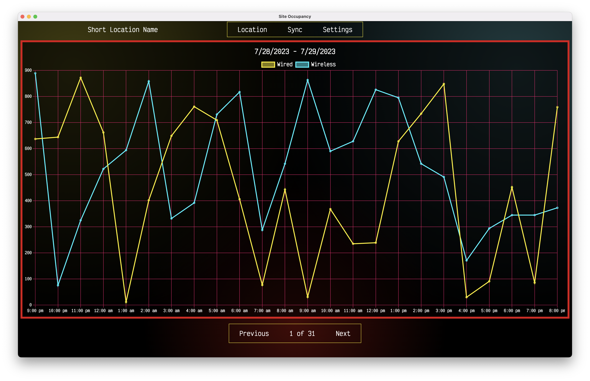

## Site Occupancy

### A simple electron application for tracking how many devices are connected to the network of a building managed under Cisco DNAC Platform

#### How to use
This is a work in progress. The frontend is being driven by mock data.

